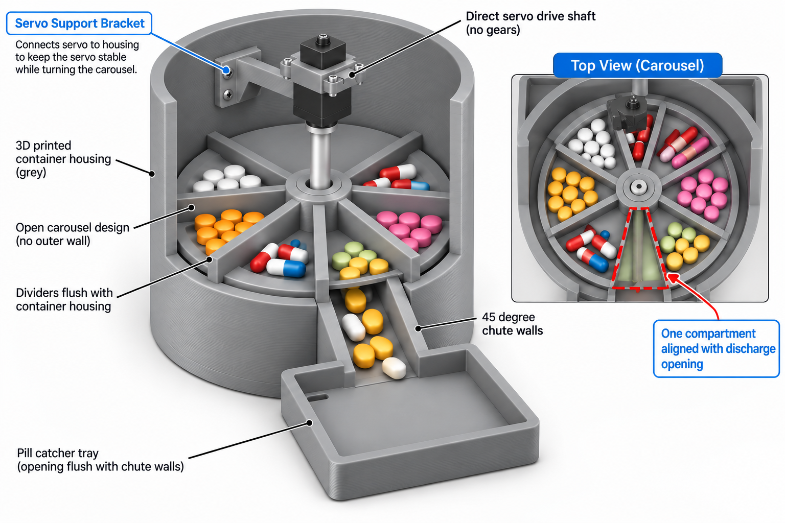

# v3 STL plan — "integral deck + open carousel"

Plan of record for the v3 reference design. The OpenSCAD sources in this folder
implement it and render clean; **STL export is deliberately not run yet** — see
section 9 for the remaining gates.



---

## 1. Design intent read from the reference

| Feature in the drawing | How it is built |
| :--- | :--- |
| Grey cylindrical container housing | 120 mm OD drum, 3 mm wall, 106 mm tall |
| Open carousel, **no outer wall** | Compartments are closed on the outside by the drum bore; the carousel is a hub + 8 radial dividers, nothing else |
| Dividers flush with the housing | 0.35 mm running gap to the deck below, 0.7 mm sweep gap to the bore |
| 8 compartments | 45 deg pitch, ~4.6 cm3 each |
| Direct servo drive shaft, no gears | MG90S above the carousel, printed shaft extension down to the hub |
| Servo support bracket | L bracket cantilevered from the inner wall to the axis, gusseted and ribbed |
| Discharge opening | One 24 deg wedge through the deck, feeding straight into the chute |
| 45 deg chute walls | Chute is integral to the housing: the channel ramps down and out through the wall |
| Pill catcher tray, opening flush with the chute walls | Mouth wall cut down; the chute lip overhangs into the well |

Load-bearing consequence of "no outer wall": the drum bore is a sealing surface,
so it must stay round and the carousel must never be forced against it. Every
clearance in section 5 follows from that.

---

## 2. Why the mechanism works, and the one number that makes it work

The deck holds the pills in. It has one wedge opening. The unit rests with the
**just-emptied compartment centred on that opening**, so there is nothing above
the opening to fall through. A 45 deg step sweeps the next compartment across the
opening and gravity empties it into the chute. One servo, no gate, no carousel
floor — the compartments are open bins exactly as drawn.

That only holds if the opening fits inside one compartment's interior with room
to spare, measured at the opening's inner radius, where a divider subtends the
most angle:

```
open_deg  <=  360/car_n - 2*asin(div_t / (2*open_r_in)) - 2*park_margin
24        <=  45        - 8.6                          - 12.4
```

So the design runs a **+/- 6.2 deg parking margin**: park more than that off
centre and the opening's edge slips past the divider and starts draining the next
compartment. `parameters_v3.scad` derives `park_margin` and every part echoes it,
so widening the opening or moving it inward fails loudly rather than silently.

Consequences worth knowing before you print:

- A **positional** servo is required. A continuous-rotation servo stepped on
  timing alone will drift past 6 deg within a few doses. A standard 180 deg MG90S
  parks to about 1 deg, well inside budget, and gives 45 deg steps across four
  stops per sweep.
- If you later want all 8 bins per fill from a continuous-rotation servo, the
  cheapest fix is one lever microswitch tripped once per revolution to re-zero,
  not a wider opening.

---

## 3. Why the housing is two prints

The deck — the surface the pills sit on and the dividers sweep — is a 114 mm disc
52 mm up inside a drum. As one piece that is either an unprintable bridge or a
support forest against the one surface that has to stay flat.

Split at the deck plane, both halves are trivial:

- **Deck body (A3)** prints as modelled: the deck's flat underside is the first
  layer, the wall rises from it, the wedge is just a hole, the pilot post grows
  upward. No supports.
- **Base body (B3)** prints open-end-down: the chute floor and the external run
  are 40-42 deg overhangs, self-supporting. No supports.

Three screwed ears outside the drum join them. Concentricity between the bodies
is deliberately not critical: the running surface *and* the bore are both on the
deck body, so only the chute has to line up, and +/- 1 mm there is harmless.

With the deck integral to the drum, the v1 failure where the drop plate rotated
instead of the carousel is designed out rather than fastened out.

---

## 4. STL manifest

Seven functional parts, three test coupons.

| # | Source file | STL | Qty | Function | Print orientation | Supports |
| ---: | :--- | :--- | ---: | :--- | :--- | :--- |
| 1 | `part_a3_deck_body.scad` | `part_a3_deck_body.stl` | 1 | Drum wall + integral deck + 24 deg wedge + pilot post + bracket screw seats + joint ears | Deck underside down | none |
| 2 | `part_b3_base_body.scad` | `part_b3_base_body.stl` | 1 | Bay + 45 deg chute + wall notch + shoulder fins + cover posts + cable port | Open end down, as modelled | none |
| 3 | `part_c3_carousel.scad` | `part_c3_carousel.stl` | 1 | Hub + 8 dividers, no floor, hex socket + pilot journal | Divider ends and hub flat on the bed | none |
| 4 | `part_d3_drive_shaft.scad` | `part_d3_drive_shaft.stl` | 1 | Horn pocket, column, hex foot | Head down | brim |
| 5 | `part_e3_servo_bracket.scad` | `part_e3_servo_bracket.stl` | 1 | Wall pad + gusset + ribbed arm + MG90S plate | Flipped, flange plane down: the pad's, arm's and servo plate's top faces are coplanar, so they form one flat footprint | none |
| 6 | `part_f3_catch_tray.scad` | `part_f3_catch_tray.stl` | 1 | Tray, mouth wall cut down to the chute lip | Flat | none |
| 7 | `part_g3_base_cover.scad` | `part_g3_base_cover.stl` | 1 | Electronics floor, foot pads | Flat | none |
| C1 | `coupon_1_sector.scad` | `coupon_1_sector.stl` | 1 | 74 deg deck sector with the wedge and pilot post + 104 deg carousel sector with the whole hub: proves the running and sweep gaps | laid out, both flat | none |
| C2 | `coupon_2_drive_train.scad` | `coupon_2_drive_train.stl` | 1 | Bracket's servo plate + the real D3 shaft + the hub's socket end: proves the three drive-train fits | laid out, shaft head down | brim under the shaft |
| C3 | `coupon_3_chute_dock.scad` | `coupon_3_chute_dock.stl` | 1 | Chute exit with the lip + the tray's mouth wall: proves the dock and the ramp in plastic | laid out, both as modelled | none |

Every part module works in assembly coordinates so the preview can use it as-is;
each file's top-level call applies that part's print orientation, which is what
`--stl` exports. So the STLs load onto the bed ready to slice — do not re-orient
them — while the preview still shows the parts where they actually sit.

Shared: `parameters_v3.scad`, `lib_v3.scad`, `assembly_preview_v3.scad`,
`check_drop_path.scad` (section 11), `check_carousel_clearance.scad` (section 12),
`render_all_v3.sh` (previews by default,
`--stl` to export).

---

## 5. Locked parameters

Drum and deck:

| Parameter | Value | Why |
| :--- | :--- | :--- |
| Drum OD / wall / bore | 120 / 3.0 / 114 mm | fits any 180 mm bed; 3 mm is 7 perimeters at 0.4 mm |
| Rim height | 106 mm | set by the bracket screws, not by looks: both have to land in wall that is above the carousel sweep (section 12) |
| Deck thickness | 5 mm | it is structural now, not a drop-in plate |
| Deck top | z = 57 mm | leaves a 52 mm bay for the chute and electronics |
| Wall/deck fillet | 1.2 mm | dividers are chamfered 1.6 mm to clear it |
| Pilot post | 10.0 mm dia, 3.1 mm tall | the carousel's only bearing |
| Joint | 3 ears at 30/150/270 deg, 3x M3 | outside the drum, nothing in the pill path |

Carousel:

| Parameter | Value |
| :--- | :--- |
| Compartments | 8 at 45 deg pitch |
| Carousel OD | 112.6 mm, i.e. 0.7 mm sweep gap per side |
| Divider thickness / height | 2.4 / 26 mm |
| Running gap to deck | 0.35 mm |
| Hub | 28 mm OD, 12 mm A/F hex socket +0.3 mm slip (6.9 mm of hub wall left) |
| Capacity | ~4.6 cm3 per bin, roughly 10-14 standard tablets |

Discharge and chute:

| Parameter | Value |
| :--- | :--- |
| Deck opening | 24 deg sector, r 16 to 57 (breaches the bore) |
| Park margin | +/- 6.2 deg, derived not asserted |
| Lead-in relief | 1.2 mm on the opening's top face |
| Chute inside width | 14 mm at the deck, 32 mm from mid-ramp out |
| Ramp | One continuous surface, y = 14 to 70. Starts *inside* the opening's 16 mm inner radius, so every tablet lands on ramp, never on its leading edge |
| Ramp slope | 38-42 deg on top; floor thickens 2.4 to 6.5 mm so the *underside* stays 40-42 deg |
| Wall notch | 32.8 mm wide, z 4 to 52. Cut as a box **minus the chute solid**, so the ramp and the chute's walls cannot be breached; only housing wall is removed |
| Notch hoop strip | Wall kept below z = 4 — closes the first layers into a full ring and stiffens the two wall ends |
| Chute lip | z = 8 mm at y = 70, overhanging the tray by 2 mm; tray mouth wall 3 mm, so 1.5 mm of clearance under the lip |

Drive train:

| Parameter | Value |
| :--- | :--- |
| Bracket reach | 57 mm; arm 22 x 8 mm plus 12 mm ribs; 18 mm gusset web |
| Bracket pad | z 85 to 112, 26 x 6 mm. Starts 1.65 mm above the divider tops; anything reaching below z 83.35 jams the carousel solid |
| Wall screws | 2x M3 from outside into the pad at z 90 and 101 — clear of the sweep, still inside the wall |
| Servo plate | 4.5 mm thick — thinner than the servo's 6 mm nose, or the shaft head fouls it |
| Flange plane | z = 112 mm |
| Shaft | 30.15 mm overall: 26 mm head, 10 mm column, 12 mm A/F hex foot with a 45 deg ramp up to the column |
| Coupling play | +/- 2.58 deg, derived and asserted against the park margin (section 13) |
| Step per dose | 45 deg |

---

## 6. Print plan

| Part | Est. filament | Est. time |
| :--- | ---: | ---: |
| C1-C3 coupons | ~30 g | ~1.5 h |
| A3 deck body | ~98 g | ~8 h |
| B3 base body | ~85 g | ~7 h |
| C3 carousel | ~35 g | ~3 h |
| F3 tray | ~25 g | ~2.5 h |
| G3 base cover | ~25 g | ~1.5 h |
| E3 bracket + D3 shaft | ~23 g | ~2 h |
| **Total** | **~320 g** | **~25.5 h** |

PLA, 0.4 mm nozzle, 0.2 mm layers, 3 perimeters, 20-25 % infill, no supports on
any part. Iron the deck body's top face if your slicer can — that is the running
surface. The chute's underside is a 40-42 deg overhang: it prints unsupported but
will look slightly rough, and it is a cosmetic surface.

---

## 7. Bought parts

| Qty | Item | Note |
| ---: | :--- | :--- |
| 1 | MG90S, **positional** (not continuous rotation) | see section 2 |
| 1 | Round servo horn, 4-hole | 20.4 mm disc |
| 2 | M3 x 10 self-tapping | bracket, from outside the wall |
| 3 | M3 x 10 self-tapping | body joint ears |
| 3 | M3 x 10 self-tapping | base cover into the posts |
| 2 | M2 x 6 | servo flange |
| 4 | M2 x 6 self-tapping | horn into the shaft head |

No bearings, no rods, no gears, no second servo.

---

## 8. Print the coupons first

About 90 minutes of printing that de-risks 23 hours. Each coupon is cut from the
real parts, so it carries the real dimensions rather than a copy of them, and each
one isolates the fits that a render cannot prove. Full instructions are in the
header of each file.

1. **C1 sector** (`coupon_1_sector.scad`) — drop the carousel sector onto the deck
   sector and spin it. Looking for no rub on the deck, no rub on the bore, no
   rocking, and a tablet that sweeps rather than slipping under a divider. If it
   rubs on the deck, `car_gap` changes; if it rubs on the bore, the 1.4 mm in
   `car_od` changes. Nothing else does.
2. **C2 drive train** (`coupon_2_drive_train.scad`) — the MG90S must drop into the
   bracket pocket without forcing, the horn must seat flush in the shaft head, and
   the hex must drop into the hub under its own weight and then rock less than a
   couple of degrees — that rotational play lands straight on the park angle, so
   this is the coupon that protects the +/- 6.2 deg margin (section 13). If it
   needs forcing, `hex_slip` goes up; if it rattles, it goes down. Stacking all
   three also measures the shaft head's 1.5 mm clearance under the servo plate,
   which is the one clearance a render can flatter.
3. **C3 chute dock** (`coupon_3_chute_dock.scad`) — the lip must overhang into the
   tray with clearance over the mouth wall, and a tablet rolled down the ramp must
   land on the tray floor without stopping on the lip or catching on the wall.
   Sight along the ramp against the light: this is where you confirm in plastic
   what section 11 proves in CAD.

Only then print A3 and B3.

---

## 9. Where this stands

| Gate | Step | State |
| :--- | :--- | :--- |
| G1 | `parameters_v3.scad`, `lib_v3.scad` | done — echoes the derived park margin |
| G2 | A3 deck body, B3 base body | done — render clean, chute fused into the wall |
| G3 | C3 carousel, D3 shaft, E3 bracket | done — shaft clears the servo plate by 1.5 mm |
| G4 | F3 tray, G3 base cover | done |
| G5 | Previews: 7 parts + 2 details + 5 assembly views + annotated hero | done, in `previews/` |
| G6 | Ramp continuity | done — `check_drop_path.scad`, see section 11 |
| G7 | `render_all_v3.sh --stl` | done — 7 STLs in `stl/`, each watertight, each in its print orientation |
| G8 | Coupons C1-C3 | done — cut from the real parts, exported to `stl/` |
| G9 | Firmware constants | done — see section 10 |

---

## 10. Firmware touch points

`firmware/pill_dispenser/pill_dispenser.ino` is on the v3 mechanism:

- 45 deg per dose, absolute stops rather than timed steps
- park position = the opening's centre, so the emptied bin covers the wedge
- 600 ms dwell after each step for the dose to reach the tray, before the vision
  check reads it
- the v1 latch servo is gone; D10 is free
- `car_n`, `car_pitch`, `park_margin` and `hex_backlash` are **generated** out of
  `parameters_v3.scad` into `pill_dispenser/v3_geometry.h` by
  `firmware/tools/geometry_from_cad.sh`, so the two cannot drift
- moves are ramped at 180 deg/s and commanded as pulse widths, because `write()`
  quantises to 1 deg and this margin cannot afford it
- the shaft is commanded past the stop by `hex_backlash` in the direction of
  travel, so the *carousel* lands on the stop; a reverse sweep flips the sign

The consequence worth planning around is the park error budget, not the torque
(section 13). Assembly can only index the carousel in 17.1 deg horn teeth, 60 deg
hex seatings and 90 deg horn screws, so up to 8.6 deg of park offset has to be
trimmed in firmware. That authority plus the coupling's play must be reserved at
both ends of the servo's travel, which is what sets the doses per fill:

    DOSES_PER_FILL = (TRAVEL_DEG - 2 * (TRIM_RANGE_DEG + hex_backlash)) / 45

A nominal 180 deg servo gives **three** doses; a measured 203 deg or more gives
four. The sketch derives it, reports it in its boot banner, and refuses the dose
after the last stop with `ERR_MAGAZINE_EMPTY` rather than pushing into the end of
the travel. `REZERO` sweeps back to stop 0 — safe only because the compartments it
crosses are the ones just emptied. All 8 bins per fill still needs a
continuous-rotation servo plus a lever microswitch to re-zero, which is the upgrade
named in section 2.

`firmware/test/run.sh` proves all of that on the host, with no board.

---

## 11. Checking the ramp is continuous

A tablet leaves the carousel through the deck's wedge and is then on its own until
it reaches the tray. Anywhere the ramp is interrupted, it drops into the
electronics bay instead — a silent partial dose, which is the worst failure this
machine has. Two things guarantee it cannot happen, and one check proves it.

The ramp starts at y = 14, inside the opening's 16 mm inner radius, so it extends
under the whole wedge rather than starting at its edge. And the notch through the
drum wall is cut as a box **minus the chute solid**, so the subtraction can only
ever remove housing wall — retuning `chute_stations`, `chute_win_w` or the notch
heights cannot put a hole in the floor.

`previews/v3_chute.png` is the section that shows it, and
`previews/v3_drop_path.png` shows the fall volume sitting on the ramp.

`check_drop_path.scad` proves it rather than assuming it. It intersects the base
body with the exact volume a tablet can fall through (the wedge, extruded from the
deck's underside down to the bay floor) and shows what material is inside it. Open
it, F5, then look straight down: the wedge footprint must be filled edge to edge.
Since the notch removes everything else under the wedge, anything you see there is
ramp, and any daylight is a hole. Re-run it after touching the chute.

---

## 12. Checking the carousel can turn

The dividers are radial, so as the carousel turns it does not sweep a thin shell —
it sweeps one solid ring: everything from z 57.35 to 83.35, from the hub out to
r 56.3. Any fixed material inside that ring is not a tight fit, it is a dead stop
on the first step, and a render hides it well: the bracket reads as *behind* the
carousel when it is really *in* its path.

That is exactly what the first cut of E3 did. Its pad stood 6 mm off the bore from
z 72 up, putting a 26 x 10.6 x 11.35 mm block of bracket inside the ring, 26 mm of
arc wide — over half a compartment pitch. All eight dividers would have hit it.

Three things now keep it out, and the geometry drives all of them:

- `brk_pad_z0 = car_top + brk_clear` — the pad cannot start below the divider tops
  because it is *derived* from them, not typed in.
- `brk_web_h` is whatever fits between the arm and the pad's foot, less 1 mm, so
  the gusset's lower tip stays out too.
- `rim_z = 106` exists to give both wall screws somewhere to land above the sweep.
  Lower the rim and the upper screw runs out of wall; `parameters_v3.scad` asserts
  that and says so.

`check_carousel_clearance.scad` proves it on the real geometry rather than on the
parameters. It intersects each fixed assembly with the swept ring, which it builds
by revolving the divider's own profile — chamfer included, so the wall/deck fillet
does not read as a clash when the 1.6 mm chamfer already clears it:

| MODE | What | Must show |
| ---: | :--- | :--- |
| 0 | bracket in the ring | nothing at all |
| 1 | deck body in the ring | the pilot post only — that one is the bearing |
| 2 | base body in the ring | nothing at all |
| 3 | drive shaft in the ring | the hex foot only — it turns with the carousel |
| 4 | the swept ring alone | for orientation |

Re-run it after moving the bracket, the rim, the wall or the divider height.

---

## 13. Will the MG90S actually turn it?

Torque first, worst case, every bin full:

| Term | How it arises | Torque |
| :--- | :--- | ---: |
| Thrust friction | the carousel hangs on the pilot post's 10 mm top face, `(2/3)·mu·W·R` | 0.5 mN·m |
| Tablet friction | 40 g of tablets sliding on the deck at a 35 mm mean radius, tripled for ploughing and pinching against the bore | 16.5 mN·m |
| Inertia | 8.7e-5 kg·m2 taken through 45 deg in 150 ms with a 50 ms ramp | 13.7 mN·m |
| **Demand** | | **31 mN·m = 0.31 kg·cm** |

Assumptions, all deliberately pessimistic: carousel 45 g (its 36.45 cm3 taken as
solid PLA, though it prints lighter), 40 g of tablets (8 bins x 12 x 0.4 g),
mu 0.35 PLA on PLA and 0.40 tablet on PLA, and an acceleration the servo will not
actually manage.

An MG90S is 1.8 kg·cm at 4.8 V and 2.2 kg·cm at 6 V, so **5.8x** margin at 4.8 V.
Derate a cheap clone 30 % and run it off the bare 3.7 V cell, which is below its
rated range, and there is still 3x. Torque is not what limits this mechanism.

Nor is strength: at stall the 12 mm hex sees 0.16 MPa on its flats and the 10 mm
PLA column under 1 MPa in torsion. The servo's nylon horn spline is the weak
point, which is the right place for one.

What *does* limit it is the park angle, and the coupling is most of the error
budget. The hex is loose on purpose, and a forward step ends with the driving
flats in contact, so the carousel parks behind its stop by the full play. At the
original 7 mm A/F and 0.4 mm slip that was +/- 6.28 deg — the entire +/- 6.2 deg
park margin, spent before the servo has contributed anything. Play goes as slip
over size, so widening the hex to 12 mm and easing the slip to 0.3 mm brings it to
+/- 2.58 deg while keeping a fit you can still drop together by hand.
`parameters_v3.scad` derives that figure and asserts it stays 2 deg inside the
margin, which leaves the servo's own ~1 deg and the print's tolerance somewhere to
live. `REZERO` reverses, so after one the carousel rests on the other flank — same
magnitude, other sign, still inside.

Speed and supply are comfortable. An MG90S slews 60 deg in about 0.1 s at 4.8 V,
so a 45 deg step takes roughly 75 ms unloaded and 110-150 ms under this load,
against the firmware's 400 ms allowance and a 600 ms fall window after it. Feed
the servo 5 V — USB, or a 5 V bank — with a bulk capacitor across it rather than
the 3.7 V cell, and let the firmware detach it after every cycle so the idle draw
is nothing.

---

## 14. Risks

| Risk | Mitigation |
| :--- | :--- |
| Bracket twists under servo reaction torque | 18 mm gusset web, 12 mm ribs, two screws 11 mm apart in the pad; if it still flexes, move the leg outside the drum where it can be as deep as you like |
| Deck warps and the carousel binds | Deck prints as the first layer; the 0.35 mm gap absorbs the rest; coupon C1 proves it before the 7 h print |
| Servo parks outside +/- 6.2 deg | Use a positional servo; verify each stop by eye on the first fill |
| Tablets wedge at the wedge edge | 1.2 mm lead-in relief on the opening's top face |
| Chute cantilevers out of the notch | Notch is only as wide as the pill passage so the chute's own walls fuse into the wall, plus two shoulder fins back to the bore and a hoop strip under the notch |
| A tablet drops through a gap in the ramp | The notch cannot breach the floor by construction, and `check_drop_path.scad` proves it — section 11 |
| Carousel parks outside the window because of coupling play | 12 mm hex at 0.3 mm slip holds the play to +/- 2.58 deg, asserted against the derived park margin — section 13 |
| Something fixed ends up in the carousel's path | Pad and gusset are derived off `car_top`, `parameters_v3.scad` asserts it, and `check_carousel_clearance.scad` proves it on the geometry — section 12 |

---

## 15. Not in v3

- No gate or shutter. The park convention makes one unnecessary.
- No homing sensor. Only needed if you insist on a continuous-rotation servo.
- No lid. The drawing has none and the bracket occupies the rim.
- No pocket inserts. Add them if small tablets rattle in a 4.6 cm3 bin.
