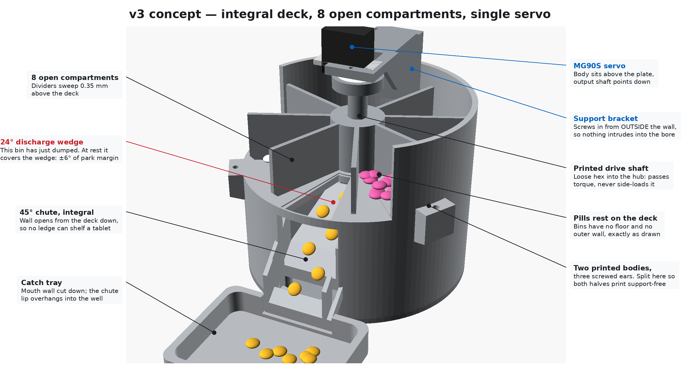

# v3 CAD set — integral deck, 8 open compartments, one servo

The design in [`reference_design.png`](reference_design.png), modelled. Geometry is
complete and renders clean; STLs are not exported yet (see `PLAN.md`, section 9).



## How it dispenses

The deck holds the pills in — the compartments have no floor and no outer wall,
so the deck below and the drum bore around them do the containing. The deck has
one 24 deg wedge opening over the chute. At rest, the compartment that has just
been emptied sits centred on that wedge, so there is nothing above the opening to
fall through. Advancing 45 deg sweeps the next compartment across the wedge and
gravity empties it down the chute into the tray.

The opening is 24 deg and a compartment's interior is 36.4 deg at that radius, so
there is **+/- 6.2 deg of parking margin**. That is the number the whole design
turns on: `parameters_v3.scad` derives it and every part echoes it. Park further
off than that and the wedge starts draining the next compartment, which is why v3
wants a positional servo rather than a continuous-rotation one.

## Files

| File | What |
| :--- | :--- |
| `parameters_v3.scad` | every dimension, plus the derived park margin |
| `lib_v3.scad` | sector/ring/tube helpers |
| `part_a3_deck_body.scad` | drum wall + integral deck + wedge + pilot post |
| `part_b3_base_body.scad` | bay + integral 45 deg chute + wall notch |
| `part_c3_carousel.scad` | hub + 8 dividers |
| `part_d3_drive_shaft.scad` | printed shaft extension, horn pocket to hex foot |
| `part_e3_servo_bracket.scad` | L bracket for the MG90S |
| `part_f3_catch_tray.scad` | tray, mouth flush to the chute lip |
| `part_g3_base_cover.scad` | electronics floor |
| `assembly_preview_v3.scad` | preview only — flags at the top of the file |
| `render_all_v3.sh` | previews by default, `--stl` also exports STLs |

## Renders

```bash
sudo apt-get install -y openscad          # once
pip install pillow                        # for the annotated hero only
./render_all_v3.sh                        # previews -> previews/
./render_all_v3.sh --stl                  # previews + stl/
```

Assembly views:

| View | |
| :--- | :--- |
| `previews/v3_hero_annotated.png` | cutaway with callouts |
| `previews/v3_cutaway.png` | wall cut away over the chute |
| `previews/v3_assembled.png` | as it sits on the desk |
| `previews/v3_section.png` | half section: deck, running gap, chute, drive train |
| `previews/v3_top.png` | 8 bins and the discharge wedge |
| `previews/v3_exploded.png` | assembly order |

One view per part, plus two details worth their own frame:

| View | |
| :--- | :--- |
| `previews/part_a3_deck_body.png` | wedge, pilot post, bracket screw seats, joint ears |
| `previews/part_a3_deck_body_deck_wedge.png` | straight down the deck: the 24 deg wedge |
| `previews/part_b3_base_body.png` | bay, chute, cover posts |
| `previews/part_b3_base_body_chute.png` | ramp through the wall notch and the shoulder fins |
| `previews/part_c3_carousel.png` | hub and 8 dividers |
| `previews/part_d3_drive_shaft.png` | shown in print orientation, head down |
| `previews/part_e3_servo_bracket.png` | MG90S pocket, gusset, ribs |
| `previews/part_f3_catch_tray.png` | cut-down mouth wall |
| `previews/part_g3_base_cover.png` | electronics floor |

Blue faces are outside surfaces, orange faces are cut surfaces — the same
convention as the v1 and v2 preview sets.

Preview flags: `CUTAWAY`, `SECTION`, `EXPLODED`, `SHOW_PILLS`, `SHOW_BRACKET`,
and `DOSE_ANGLE` (22.5 = at rest with the emptied bin over the wedge).

## Assembly order

1. Screw the round horn into the **drive shaft** head (4x M2).
2. Drop the **carousel** into the **deck body**, hub onto the pilot post.
3. Drop the shaft's hex foot into the hub socket. It should be a loose fit — that
   is intentional, so the shaft passes torque without side-loading the carousel.
4. Bolt the **bracket** to the wall with 2x M3 driven in from *outside* the drum.
5. Push the **MG90S** down through the bracket's plate onto the horn's spline,
   then 2x M2 through the flange.
6. Mount the electronics on the **base cover**, screw it into the **base body**'s
   three posts, route the cable through the rear port.
7. Stack the deck body on the base body and screw the three ears together.
8. Butt the **tray** up to the chute lip.

To refill or service: take out 2 bracket screws, lift the bracket, servo and
shaft off as one unit, and the carousel lifts straight out of a clear 114 mm bore.

## Differences from v2

v2 is the printable "fix the v1 failures" set: separate keyed plate, holed and
ramped carousel floor, four-arm servo spider, separate chute insert. v3 follows
the newer reference drawing instead: the deck is integral to the housing (so no
plate can rotate), the compartments are open bins, the chute is part of the
housing, and the servo hangs from a single L bracket. Fewer parts, fewer
interfaces, and it needs a positional servo where v2 tolerated a sloppier one.
