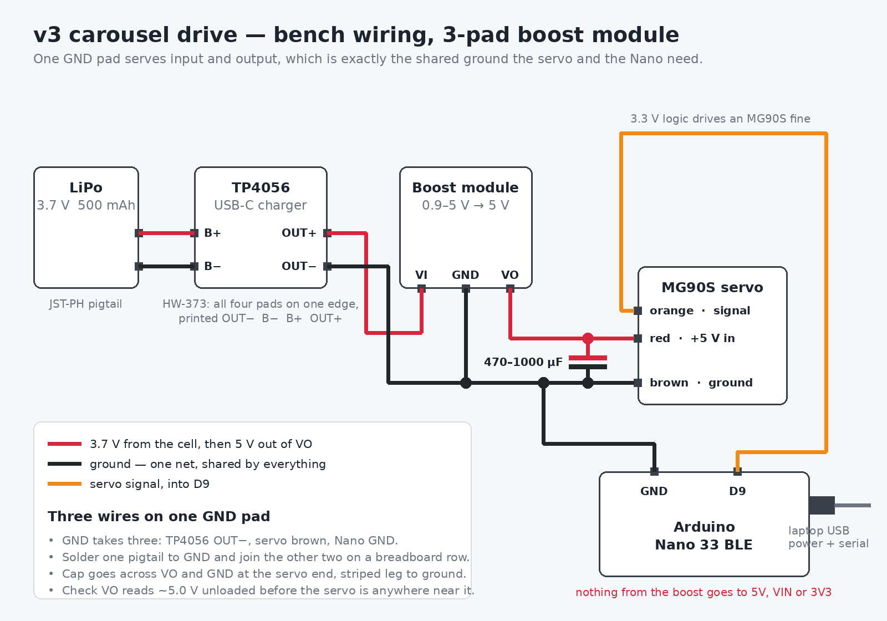

# Firmware — Arduino Nano 33 BLE

## Sketch

`pill_dispenser/pill_dispenser.ino` — non-blocking state machine for the v3
mechanism: **one** positional MG90S on D9, driving the carousel directly. There is
no latch servo; the v3 deck parks the just-emptied compartment over the discharge
opening, so nothing sits above it between doses and there is nothing to hold shut.
D10, the v1 latch channel, is free.

Geometry constants are **generated** from `cad/v3/parameters_v3.scad` into
`pill_dispenser/v3_geometry.h` by `tools/geometry_from_cad.sh`, so the sketch and
the CAD cannot drift apart. Re-run that script after changing the carousel pitch,
the deck opening or the hex coupling; the generated header is committed, so
building needs OpenSCAD only when the geometry changes.

| From the CAD | Value | Why the sketch cares |
| :--- | :--- | :--- |
| `STEP_DEG` | 45° | One of 8 compartments (`car_pitch`) |
| `PARK_MARGIN_DEG` | 6.2° | How far off centre park may be before the wedge drains the *next* bin |
| `COUPLING_PLAY_DEG` | 2.58° | The loose hex's rotational play (`hex_backlash`) |

**Everything follows from the park margin.** Three things spend it and the sketch
manages all three.

*Where the horn landed.* The output spline indexes in 17.1° teeth (14.4° on a
25-tooth servo), the hub's hex in 60° and the horn screws in 90°, so assembly alone
can leave the carousel up to 8.6° off centre — more than the margin. Nothing
mechanical adjusts finer, so `TRIM` and `JOG` shift the whole stop table at run
time, with `TRIM_RANGE_DEG` (9°) of authority reserved for them.

*The coupling's play.* The hex is loose so it cannot side-load the carousel, which
costs ±2.58°. A move ends with the driving flats in contact, so the carousel trails
the shaft by that much in whichever direction it last moved; the sketch commands
the shaft that far *past* the stop so the carousel lands *on* it. Reverse a sweep
and the take-up flips sign, which is why `REZERO` ends on a different pulse than a
forward arrival at the same stop.

*The servo's own error*, about a degree, which is what is left.

**Doses per fill is derived, not assumed.** Trim and play have to be reserved at
both ends of the travel, so:

```
DOSES_PER_FILL = (TRAVEL_DEG - 2 * (TRIM_RANGE_DEG + COUPLING_PLAY_DEG)) / STEP_DEG
```

A nominal 180° servo gives **three**. Measure 203° or more — many MG90S reach about
200° between 500 and 2500 µs — and the fourth comes back on its own. After the last
dose `DISPENSE` returns `ERR_MAGAZINE_EMPTY` rather than pushing into the end of the
travel and reporting a dose that never fell. `REZERO` then sweeps back to stop 0,
safe only because the compartments it crosses are the ones it just emptied. The
sketch prints what it derived in its `CAL` banner, so a log always says which it
was.

**Pulse widths, not degrees.** `write()` quantises to 1° (about 10 µs) and pins the
range to the core's 544–2400 µs mapping; this margin can afford neither, so the
sketch commands `writeMicroseconds()` against measured endpoints.

**Ramped, not stepped.** A bare `write()` makes the servo slam the full 45° at
maximum speed: the peak-current case on a small cell, the peak-torque case on a
printed PLA coupling, and the case most likely to overrun a stop on inertia.
`SLEW_DEG_PER_S` (180°/s, so 45° in 250 ms) sets the rate and each move's duration
follows from it, so the timing and the motion cannot disagree. `SETTLE_MS` then
holds the target before the tablet is allowed to move.

## Bench bring-up — wiring and first turns

Nano, servo, one 5 V supply. No carousel yet: run this with the drive shaft **out of
the hub**, or with every bin empty, because a step is a real 45° carousel move and it
will drop whatever sits above the discharge opening.



Redraw it with `python docs/diagrams/bench_wiring.py` after changing any of this.

| Servo lead | Goes to | Notes |
| :--- | :--- | :--- |
| Orange (signal) | Nano **D9** | 3.3 V logic drives an MG90S fine; if it twitches or ignores commands, put a level shifter on this line |
| Red (V+) | External **5 V**, 1 A or better | A USB breakout, bench supply or power bank — **not** the Nano's 3V3 pin |
| Brown (GND) | Nano **GND** *and* the 5 V supply's ground | The grounds must be common or the pulse has no reference |

### Where the 5 V comes from

The kit's 3.7 V LiPo is below the MG90S's 4.8–6 V rating, so the boost module is what
makes the cell usable. Chain it like this — the cell never touches the servo directly:

```
LiPo JST ──> TP4056 B+/B− ──> TP4056 OUT+ ──> boost VI
                              TP4056 OUT− ──> boost GND ──┬─> servo BROWN
                                                          └─> Nano GND
                                             boost VO  ────> servo RED
```

The cheap boost modules have three pads in one row — `VI`, `GND`, `VO` — with input and
output sharing that single ground, which is the shared node this wants anyway. It takes
three wires: `OUT−` in, servo brown out, Nano `GND` out. Solder one pigtail to the pad
and join the other two on a breadboard row rather than stacking three wires on a pad
that size. On the HW-373 TP4056 all four pads sit along one edge, printed `OUT− B− B+
OUT+`; the cell goes to the `B` pair, never to `OUT`.

The TP4056 is in the chain for its protection circuit, not for charging: a boost module
happily runs down to 0.9 V in and would flatten an unprotected cell past recovery. Even
with it, stop at about 3.4 V rather than waiting for the 2.4 V cutoff.

The Nano keeps its own USB power, which the serial link needs anyway. **Ground is the
only node the two rails share** — nothing from the boost output goes near `3V3`, `5V`
or `VIN`, so a servo brownout cannot reset the board mid-cycle.

These small modules give roughly 500–600 mA at 5 V and an MG90S can pull more than that
against a jam. With a meter, check the output holds above 4.5 V while a step runs. Without
one, the symptoms are the substitute: a stuttering horn, a servo that keeps buzzing after
it arrives, or a Nano that disconnects from USB mid-move all mean the module is sagging —
1000 µF instead of 470 µF, or halve `SLEW_DEG_PER_S` to spread the same move over twice
the time, or run the bench check off a USB power bank and save the LiPo for the untethered
demo.

**No meter.** Read the silkscreen instead of a voltage. On the boost module the cell side
is `VI`, the servo side is `VO`, and `GND` is shared; on the HW-373 the cell is on `B+/B−`
and the boost takes `OUT+/OUT−`. With the servo's red lead still unplugged, power the
chain for a few seconds and touch nothing — the boost module and the TP4056 should stay
cool (warm is fine, hot means a short). Then plug the servo in and start with `--wiggle`:
a few degrees each way is enough to prove the wiring without a reading. A horn that sits
still while the script prints `ACK_PULSE` usually means `VI`/`VO` are swapped, or the
Nano's ground never reached the shared `GND` pad.

Two more things bite here. The Nano 33 BLE's **`5V` pin is disconnected from the factory** —
it only carries USB power once the `VUSB` solder jumper on the underside is bridged —
so treat the servo's supply as external rather than expecting 5 V from the header. And
a stall on a small cell browns the Nano out through the shared ground, which is why the
sketch ramps every move; a 470–1000 µF capacitor across the servo's V+/GND, at the
servo end, absorbs what is left.

```bash
arduino-cli upload -p /dev/ttyACM0 --fqbn arduino:mbed_nano:nano33ble firmware/pill_dispenser
python edge/bench_servo.py --cmd PING     # link only, nothing moves
python edge/bench_servo.py --wiggle       # a few degrees each way, first contact
python edge/bench_servo.py                # the full fill, 45 deg at a time
```

Work up in that order. `--cmd PING` proves the port and the sketch without commanding
the servo at all, `--wiggle` proves the signal and the supply with moves too small to
throw anything, and only then is a full 45° step worth trying.

`edge/bench_servo.py` is the bench harness for exactly this moment. Its default run
greets the board, prints the calibration it derived, then steps a whole fill and
rezeros, timing each move:

```
  calibration: CAL US=600..2400 TRAVEL=180.0 PLAY=2.58 TRIM=0.00 DOSES=3
  step 1: ACK after 991 ms (45 deg from stop 0)
  step 2: ACK after 990 ms (90 deg from stop 0)
  step 3: ACK after 990 ms (135 deg from stop 0)
  step 4: refused, magazine spent — correct after 3 doses
  rezero: ACK after 1100 ms — shaft should be back on the mark
```

Mark the horn before you start. Each `ACK_DISPENSE` is one bin, so three steps is 135°
of carousel and `REZERO` should bring the mark back where it began. A mark that does
not return means the coupling is slipping on the horn, not a firmware problem. Other
modes: `--wiggle` for first contact, `--ends` for the guided endpoint hunt below,
`--sweep 600 2400 --step 200` to walk raw pulses, `--cmd "TRIM 3"` to send anything by
hand, `--list` for the ports.

## Commissioning a servo

Do this once per servo, with the carousel empty. It replaces four constants at the
top of the sketch and one runtime trim.

1. **Find the ends.** `PULSE <us>` commands a raw pulse anywhere in 500–2500 µs, which
   is wider than the calibrated ends on purpose: finding them is the point.
   `python edge/bench_servo.py --ends` creeps outward from 1500 µs in 100 µs steps and
   asks, after each one, whether the horn moved further the same way. `y` continues,
   `n` means it only buzzed in place (that is the stop), and `q` means it jumped back
   the other way, which is the pulse going past the feedback pot — the hunt stops
   there rather than stripping the gears. Enter by
   itself is ignored, because holding it down used to run into the 500–2500 µs envelope
   and print those limits as if they were the stops. It backs off 50 µs from the last
   pulse that moved and, if you type both dial readings, prints `TRAVEL_DEG` and whether
   that is three doses or four. Put the two pulses in `US_MIN_SAFE` / `US_MAX_SAFE`.
2. **Measure the travel.** Print [`docs/diagrams/servo_protractor.png`](../docs/diagrams/servo_protractor.png)
   at 100%, cut its centre out, slip it over the horn screw and tape a toothpick along
   the horn. Read the pointer at each end; the difference is `TRAVEL_DEG`. The dial marks
   203° in blue because that is the threshold where a fill gives four doses instead of
   three, and its red ticks are the carousel's 45° bin pitch, so one `DISPENSE` should
   move the pointer exactly one tick. Recompile after setting it: the sketch reports the
   doses per fill it derives, and its `static_assert`s refuse a table that will not fit.

   No printer? The carousel is its own protractor — eight dividers at 45°. Sweep end to
   end with it loosely on the shaft and count: more than four and a half bin pitches
   means you have the 203°.
3. **Check each dose is one bin.** `python edge/bench_servo.py --dump` rezeros,
   then dispenses one dose at a time and waits. The carousel must advance 45° per
   dose. The horn moves 45° plus twice the coupling play on the first dose — the
   shaft takes the play up from the reverse side the rezero left it on — and 45°
   after that. Type the dial reading after each dose and it reports the error
   against a ±2° band. Three doses each 3° short land on the next compartment,
   which is why the band is tighter than the ±6.2° park margin.

   A step that is short or long by the same amount every time is the pulse scale,
   not the park: finish step 2 and set `TRAVEL_DEG`. `JOG` only recentres the park.
   With the carousel fitted and one compartment filled, `JOG 2` / `JOG -2` until
   the just-emptied compartment sits over the opening. `STATUS` shows the trim.
4. **Record it.** The trim lives in RAM. Log the value and have the host send
   `TRIM <deg>` on connect, or paste it into `PARK_TRIM_DEG`'s default and
   recompile.

## Serial protocol @ 115200

A superset of the v1 protocol, so hosts that only speak `DISPENSE` /
`ACK_DISPENSE` — including `edge/hardware_bridge.py` — need no changes.

| Host sends | Device replies | Notes |
| :--- | :--- | :--- |
| `DISPENSE` | `ACK_DISPENSE` | About 1 s: 270 ms ramp, 120 ms settle, 600 ms for the dose to reach the tray |
| | `ERR_BUSY` | Mid-cycle |
| | `ERR_MAGAZINE_EMPTY` | Last stop reached; refill and `REZERO` |
| `REZERO` | `ACK_REZERO` | Ramps back to stop 0; duration follows the distance |
| `SETSTOP n` | `ACK_SETSTOP` / `ERR_ARG` | Corrects the sketch's count **without moving** |
| `TRIM d` | `ACK_TRIM <deg>` / `ERR_ARG` | Sets the park offset, ±9°, and re-seats the carousel on its stop |
| `JOG d` | `ACK_TRIM <deg>` / `ERR_ARG` | Same, relative to the trim in force |
| `PULSE us` | `ACK_PULSE <us>` / `ERR_ARG` / `ERR_BUSY` | Commissioning: ramps to a raw pulse in 500–2500 µs, then marks the magazine spent so no `DISPENSE` can follow a hand-jogged position |
| `STATUS` | `STATE=s STOP=i/n ANGLE=d US=u TRIM=t DOSES=n` | |
| `CAL` | `CAL US=a..b TRAVEL=t PLAY=p TRIM=t DOSES=n` | Also printed at boot |
| `PING` | `PONG` | |

`TRIM` and `JOG` answer only once the carousel has settled on its stop, so the
reply means the offset is in effect rather than merely accepted.

The servo holds its angle mechanically when unpowered, so the carousel's position
survives a power cycle but the sketch's idea of it does not. On boot it assumes
stop 0 and deliberately commands no angle — writing one could sweep full
compartments across the opening and dump them. A host that logged the doses can
correct the count with `SETSTOP`.

## Check the behaviour without a board

```bash
./firmware/test/run.sh
```

Compiles the sketch on the host against small stubs — fake clock, fake serial,
recording servo — and drives it through every dose of a fill and the refusal after
them, the ramp (monotonic, starting where it believed it was, ending on the pulse
the park budget calls for), the play take-up flipping sign on a reverse sweep,
`TRIM`/`JOG` authority and bounds, `PULSE` reaching past the calibrated ends and
locking out `DISPENSE` until the stop is re-established, and a sweep proving no pulse
in normal operation left the servo's measured ends. 65 checks, needs only `g++`. See
`firmware/test/host_harness.cpp`.

This complements the toolchain check below rather than replacing it: one proves
the logic, the other proves it builds for the real target.

## Check Arduino IDE / toolchain without a board

You do **not** need the Nano plugged in to confirm the IDE/toolchain works. Compile (Verify) only:

**Option A — Arduino IDE GUI**

1. Install board pack: *Tools → Board → Boards Manager → “Arduino Mbed OS Nano Boards”*
2. Install library: *Tools → Manage Libraries → Servo*
3. Open `pill_dispenser/pill_dispenser.ino`
4. Select board: **Arduino Nano 33 BLE**
5. Click **Verify** (✓) — not Upload

**Option B — script (`arduino-cli`)**

```bash
# Linux / macOS / WSL
chmod +x firmware/verify_arduino_toolchain.sh
./firmware/verify_arduino_toolchain.sh
```

```powershell
# Windows PowerShell
.\firmware\verify_arduino_toolchain.ps1
```

Success means `Servo.h` resolved and the sketch built for `arduino:mbed_nano:nano33ble`.

## Upload later (board connected)

```bash
arduino-cli board list
arduino-cli upload -p /dev/ttyACM0 --fqbn arduino:mbed_nano:nano33ble firmware/pill_dispenser
```

Windows: use `COM3` (or your port) instead of `/dev/ttyACM0`.
